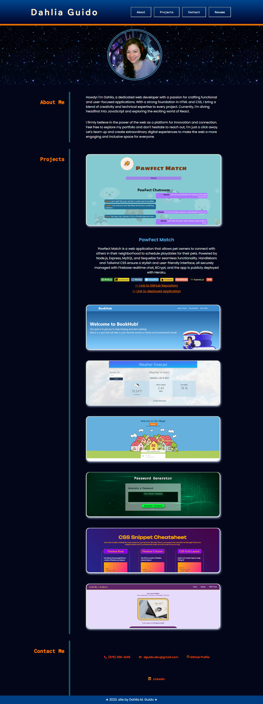

# Dahlia's Git Portfolio
Module 02 Challenge. Create a functional portfolio.

**Link to the deployed site: [Click here!](https://cyphernyx.github.io/dahlia-git-portfolio/)**

## Portfolio Showcase

This portfolio showcase is a GitHub repository project that allows employers to view my deployed portfolio of github projects. It provides a user-friendly interface to review my work and assess my suitability for any open positions.

## Features

- [x] Introduces my name, photo, and sections about me, my projects, and contact information.
- [x] Smooth scrolling navigation for easy access to different sections.
- [x] Section dedicated to displaying titled images of the deployed applications.
- [x] Prominent display of the first application's image, larger in size than the others.
- [x] Direct links to the deployed applications for hands-on exploration.
- [x] Responsive layout that adapts to various screen sizes and devices.

## Usage

## Proposed Wireframe:

## Credits
- Stars backgroungd GIF: [Click here for source](https://giphy.com/gifs/stars-U3qYN8S0j3bpK?utm_source=media-link&utm_medium=landing&utm_campaign=Media%20Links&utm_term=)
- Favicon emoji: [Click here for source](https://favicon.io/emoji-favicons/laptop)